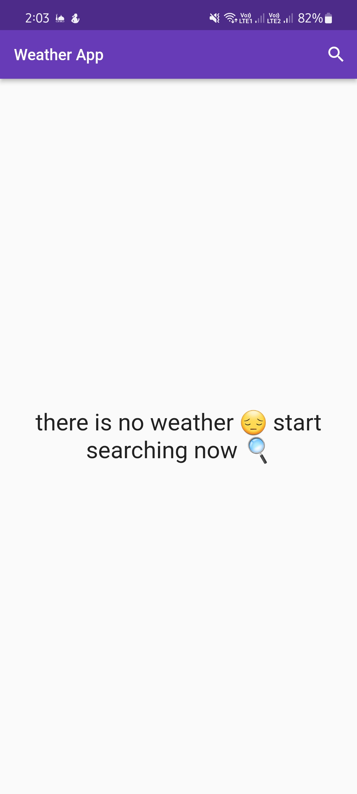
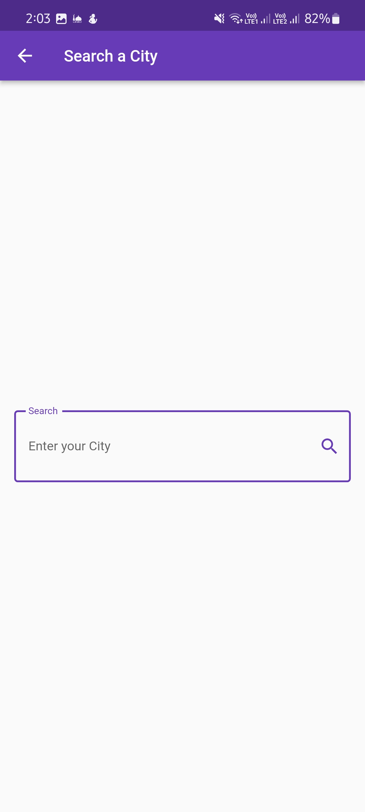
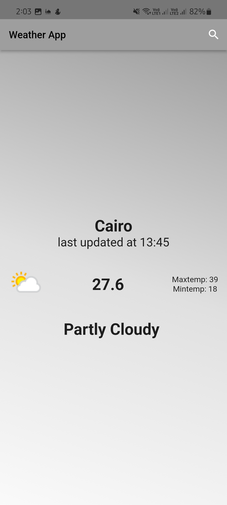

# Weather App 🌦️  

A Flutter app that fetches real-time weather data using RESTful APIs, implements Cubit state management, and dynamically adapts UI themes based on weather conditions. Built as part of **Tharwat Samy's Flutter & Dart Development Course**.  

[](your_apk_link_here)  
[](https://flutter.dev)  
[](https://dart.dev)  

---

## Features 🌟  
- **Dynamic UI**:  
  - Adaptive themes using `LinearGradient` based on weather conditions (e.g., sunny, rainy). 

  - Custom splash screen and app icons via `flutter_native_splash` and `flutter_launcher_icons`.  

- **API Integration**:  
  - RESTful API workflows using **Dio** (auto-JSON parsing).

  - Secure API key management and parameterized endpoints.  
  - Model classes with null-safety and dual constructors (normal/named).  

- **State Management**:  
  - **Cubit** for isolated business logic and UI separation.  

  - States: `NoWeatherState`, `WeatherLoadedState`, `WeatherFailureState`.  

  - `BlocProvider` and `BlocBuilder` for reactive UI updates.  

- **Error Handling**:  
  - `try/catch` blocks with custom exception messages.  

  - UI feedback for invalid cities or network errors.  

- **Android Config**:  
  - Internet permission and cleartext traffic enabled in `AndroidManifest.xml`.  

---

## Screenshots 📸  
| Home Screen | Search Screen | Weather Display |  
|---------------|---------------|-----------------|  
|  |  |  

---

## Installation ⚙️  
1. **Clone the repository:**  
   ```bash  
   git clone https://github.com/yourusername/Weather-App.git 
2. **Install dependencies:**  
    ```bash
    flutter pub get
3. **Run the app:**
    ``` bash
    flutter run
---

## API Integration 🌐
- **Endpoint:** Base URL and API Key are defined as variables for easier maintenance.
    ``` dart
    final baseUrl = "https://api.weatherapi.com/v1"; 
    
    final apiKey = "YOUR_API_KEY";  
- **Example Fetch:**
    ``` dart
    // Inside Cubit  
    try {  
    final response = await Dio().get("$baseUrl/current.json?key=$apiKey&q=$city");

    emit(WeatherLoadedState(weather: WeatherModel.fromJson(response.data)));  
    
    } catch (e) {  
    
    emit(WeatherFailureState(errorMsg: "City not found!"));  
    
    }
- **Model Class:**
    ``` dart
    factory WeatherModel.fromJson(Map<String, dynamic> json) {  
  return WeatherModel(  
    temp: json['current']['temp_c'],  
    condition: json['current']['condition']['text'],  
  );  
    }  

---

## Project Structure 🗂️
    ``` bash
    lib/  
    ├── cubits/          # State management (e.g., weather_cubit.dart)  
    ├── models/          # Data classes (e.g., weather_model.dart)  
    ├── services/        # API services (e.g., weather_service.dart)  
    ├── views/           # Screens (e.g., home_view.dart, search_view.dart)  
    └── main.dart        # App entry point  
    ```
---

## Key Learnings 🧠
- Mastered dynamic UI construction in Flutter.

- Explored multiple approaches to state management.

- Gained insights into advanced API integration and error handling.

- Improved debugging techniques and best practices for clean, maintainable code.

---

## Acknowledgements:
- Course Instructor: [Tharwat Samy](https://github.com/tharwatsamy)
- API Provider: [WeatherAPI.com](https://www.weatherapi.com/)